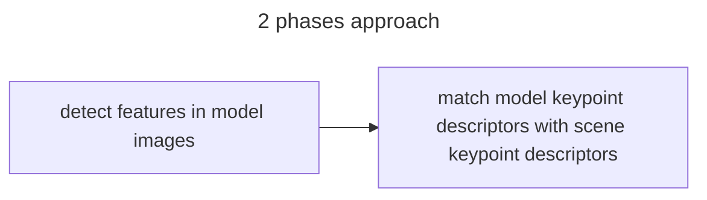

# OBJECT DETECTION PROJECT REPORT

as shown in the requirements the goal of the project is to detect istances of a product given as model in a multiple sets of target images.

## STEP 1

### Project analisys

For the first set of images, given the fact that only one instance of the model was present in the target image, the team decided to adopt an approach based on local invariant features and a kdtree based matching process

### Implementation

The system is implemented with a 2 step approach, in the first phase key-points and sift descriptor are computed from the model images and in the second step model descriptor are used to find correspondences in the target image using BFF search algorithm. key-points detection and descriptor computation and matching are performed trough the use of the opencv functions

## STEP 2

### Project analisys

For the second set of images, in order to detect multiple instances of the same model,[generalized hough transform](https://carnivuth.github.io/computer_vision/pages/object_detection/GENERALIZED_HUGH_TRANSFORM) with [SIFT](https://carnivuth.github.io/computer_vision/pages/local_features/SIFT_DESCRIPTOR) descriptors was deployed

### Implementation

The implementation of GHT present in the [opencv library](https://docs.opencv.org/3.4/dc/d46/classcv_1_1GeneralizedHoughBallard.html) is not capable of doing comparison using SIFT descriptors, in order to address this issue the team decided to implement the GHT algorithm.

Again  project is divided in a 2 step approach where in the first phase model key-points and descriptors are computed and then detection is performed.To find instances a voting process is performed using a bi-dimensional accumulator array, for each match between key-points the center of gravity is computed and used to cast a vote in the accumulator.In order to increase resistance against noise, the accumulator cell size can be tuned

The accumulator is scanned searching for local maximums, and voters and coordinates are returned, The computed results are used to build bounding boxes inside the scene image using homographies

## Conclusions

To get better results from the GHT algorithm accumulator cell size and neighborhood of the local maximum search algorithm need to be accurately tuned to increase robustness w.r.t noise

